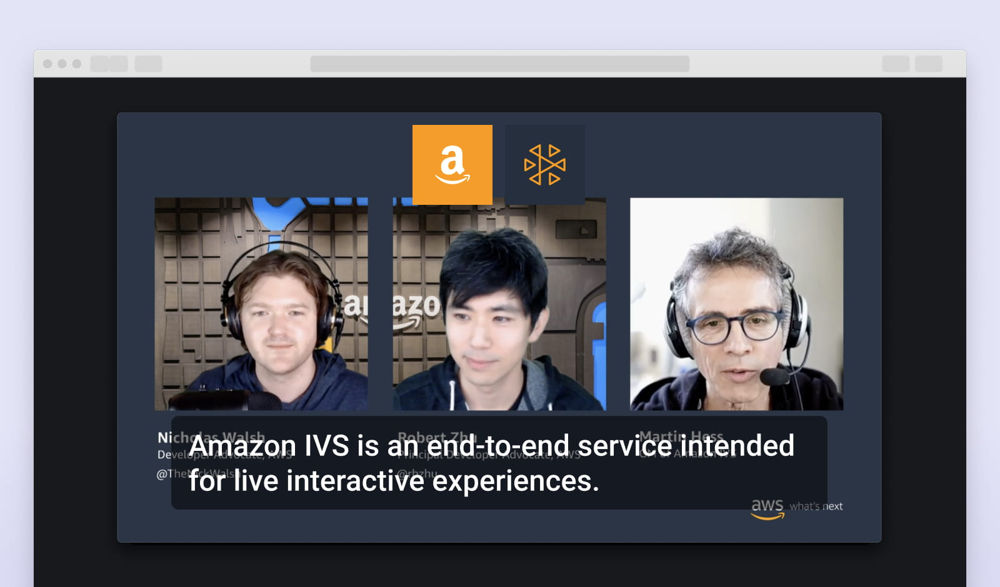
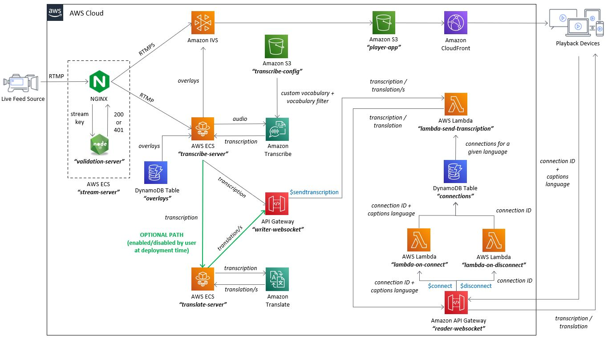

# Amazon IVS Auto-captions Web demo

A demo web application for demonstrating how you can use Amazon IVS in conjunction with Amazon Transcribe to deliver real-time captions for live streams. This demo also shows how Amazon Translate can be used to deliver auto-translated captions to viewers (optional during deployment).

**This project is intended for education purposes only and not for production usage.**

This is a serverless web application, leveraging [Amazon IVS](https://aws.amazon.com/ivs/), [Amazon Transcribe](https://aws.amazon.com/transcribe/), [Amazon ECS](https://aws.amazon.com/ecs/), [Amazon API Gateway](https://aws.amazon.com/api-gateway/), [AWS Lambda](https://aws.amazon.com/lambda/), [Amazon DynamoDB](https://aws.amazon.com/dynamodb), [Amazon S3](https://aws.amazon.com/s3/) and [Amazon CloudFront](https://aws.amazon.com/cloudfront/). The web user interface is a single page application built using [React.js](https://reactjs.org/) and the [Amazon IVS Player](https://docs.aws.amazon.com/ivs/latest/userguide/player.html). The demo showcases how you can add real-time live captioning to an Amazon IVS stream using Amazon Transcribe. It also showcases how to configure image overlays to appear on top of the video player based on specific keywords, using [TimedMetadata](https://docs.aws.amazon.com/ivs/latest/userguide/metadata.html). This demo uses [Amazon API Gateway WebSockets](https://docs.aws.amazon.com/apigateway/latest/developerguide/apigateway-websocket-api.html) to deliver the captions to the connected clients, which are then used as a WebVTT track.

 

## Getting Started

⚠️ **IMPORTANT NOTE:** *Deploying this demo application in your AWS account will create and consume AWS resources, which will cost money.*

To get the demo running in your own AWS account, follow these instructions.

1. If you do not have an AWS account, please see [How do I create and activate a new Amazon Web Services account?](https://aws.amazon.com/premiumsupport/knowledge-center/create-and-activate-aws-account/)
2. Log into the [AWS console](https://console.aws.amazon.com/) if you are not already. Note: If you are logged in as an IAM user, ensure your account has permissions to create and manage the necessary resources and components for this application.
3. Follow the instructions for deploying to AWS.

### Deploying to AWS
* To configure and deploy this demo, follow the [deployment instructions](./deployment/README.md).
* Once deployed, to configure (optional), follow the [configuration instructions](./configuration/README.md).

 

## Architecture

 

## Known issues and limitations
* The application was written for demonstration purposes and not for production use.
* Currently only tested in **us-west-2 (Oregon)** and **us-east-1 (N. Virginia)** regions. Additional regions may be supported depending on service availability.
* Current solution has a maximum limit of 200 users connected at the same time to a given stream with the same captions language selected. Starting from 200 connected users and up, the execution time of the query to get the connections to deliver the captions in that specific language is increased, adding latency to captions visualization until the query execution time causes a timeout in the Lambda function (which is set at 3 seconds), resulting in no captions being seen at all.
* In Firefox, captions may appear very close to the bottom border of the video when there are 4 or more rows of captions.  

 

## Estimated costs
Deploying this demo application in your AWS account will create and consume AWS resources, which will cost money. 

Below is a table with estimated costs for scenarios with 1, 10, and 100 viewers, each receiving video in 1080p resolution during 1 hour with four translations enabled.

> Note: These costs are estimates. Cost may vary depending on multiple factors such as (but not limited to) region, amount of viewers, duration, number of captions in the video, enabling the Translate feature, the number of translations that are activated, etc. Note that the estimated prices are in dollars and do not include taxes.

 

| Service                                                              | 1 viewer | 10 viewers | 100 viewers |
| -------------------------------------------------------------------- | -------: | ---------: | ----------: |
| [Amazon Translate](https://aws.amazon.com/translate/pricing/)               |    30.78 |      30.78 |       30.78 |
| [Elastic Container Service](https://aws.amazon.com/fargate/pricing/) |     2.27 |       2.27 |        2.27 |
| [Interactive Video Service](https://aws.amazon.com/ivs/pricing/)     |     2.15 |        3.5 |          17 |
| [Transcribe](https://aws.amazon.com/transcribe/pricing/)             |     0.73 |       0.73 |        0.73 |
| [CloudWatch](https://aws.amazon.com/cloudwatch/pricing/)             |     0.09 |       0.09 |        0.09 |
| [DynamoDB](https://aws.amazon.com/dynamodb/pricing/on-demand/)       |     0.02 |       0.25 |         2.5 |
| [API Gateway](https://aws.amazon.com/api-gateway/pricing/)           |     0.02 |       0.25 |         2.5 |
| [Elastic Container Registry](https://aws.amazon.com/ecr/pricing/)    |     0.09 |       0.09 |        0.09 |
| [Lambda](https://aws.amazon.com/lambda/pricing/)                     |     0.00 |       0.02 |        0.25 |
| [S3](https://aws.amazon.com/s3/pricing/)                             |     0.00 |       0.00 |        0.00 |
| [CloudFront](https://aws.amazon.com/cloudfront/pricing/)             |     0.00 |       0.00 |        0.02 |
| Total estimated cost                                                           |    36.15 |      37.98 |       56.23 |

 

## About Amazon IVS
* Amazon Interactive Video Service (Amazon IVS) is a managed live streaming solution that is quick and easy to set up, and ideal for creating interactive video experiences. [Learn more](https://aws.amazon.com/ivs/).
* [Amazon IVS docs](https://docs.aws.amazon.com/ivs/)
* [User Guide](https://docs.aws.amazon.com/ivs/latest/userguide/)
* [API Reference](https://docs.aws.amazon.com/ivs/latest/APIReference/)
* [Learn more about Amazon IVS on IVS.rocks](https://ivs.rocks/)
* [View more demos like this](https://ivs.rocks/examples)